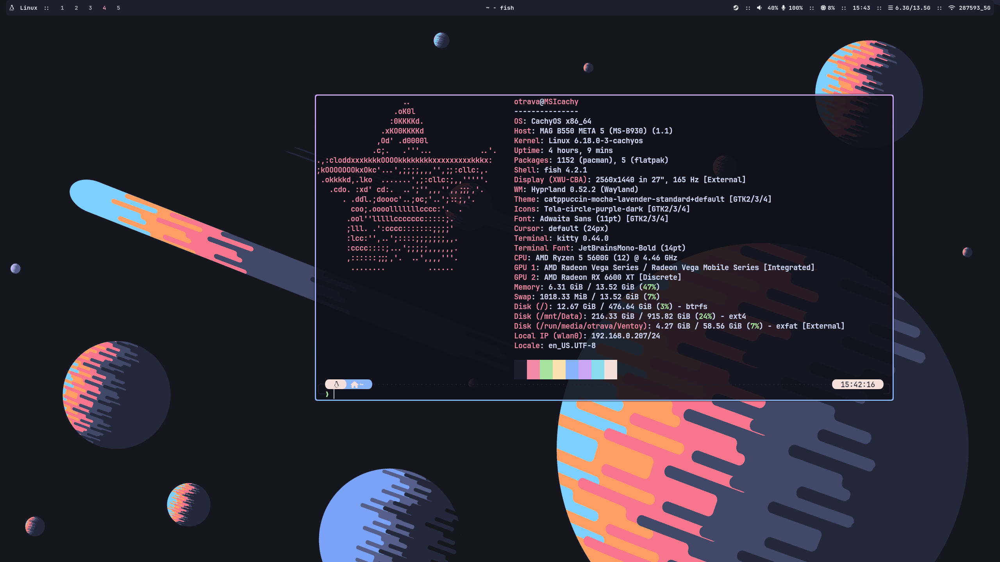

# Hyprland Dotfiles (Catppuccin Mocha) for Arch Linux

**Installation:**

AUR Helper (only yay):

```
git clone https://aur.archlinux.org/yay.git
cd yay
makepkg -si
```
Run the script:

```
git clone https://github.com/o0travaa/hyprland-dotfiles-catppuccin-mocha.git
cd hyprland-dotfiles-catppuccin-mocha
./install.sh
```

**Screenshots:**


**After:**
For wallpapers use "swaybg"

`sudo pacman -S swaybg`

In Hyprland Config:
```
$swaybg = swaybg -i path-to-your-image.png
exec-once = $swaybg
```

